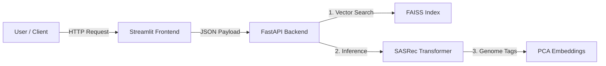

#  ScaleRec: Full-Stack Real-Time Recommendation Engine

    

**ScaleRec** is a production-grade recommendation system that mirrors the **candidate generation** phase of modern streaming platforms like Netflix and YouTube.

Unlike traditional static recommenders, ScaleRec is **session-aware**. It uses a **Transformer-based architecture (SASRec)** to understand the *sequence* of user actions, injected with semantic **Genome Tags** to handle the cold-start problem.

---

##  Full-Stack Architecture

The system is deployed as a microservices application using Docker Compose:



---

##  Tech Stack

- **Frontend:** Streamlit (Interactive UI for simulating user history)
- **Backend:** FastAPI (Async REST API)
- **Model:** TensorFlow 2.x (SASRec: Self-Attentive Sequential Recommender)
- **Vector Search:** FAISS (sub-10ms retrieval)
- **Data Engine:** Polars (Rust-based DataFrame library; 25M rows)

---

##  Why This Project Is Tier-1

| Feature | Standard Student Project | ScaleRec (This Project) |
|---|---|---|
| **Model Type** | Matrix Factorization (Static) | Sequential Transformer (Dynamic) |
| **Context** | Ignores time/order | Understands sequence (A  B  C) |
| **New Items** | Fails (Cold Start) | Works via Genome Semantics |
| **Serving** | Slow Python Script | FastAPI + FAISS (Production Speed) |
| **Deployment** | Jupyter Notebook | Docker Containers (Cloud Ready) |

---

##  Quick Start (Docker)

You can run the entire full-stack application with a single command.

**Prerequisites**
- Docker
- Docker Compose
- Optional: 4GB+ RAM allocated to Docker

**1. Run the app**

```bash
docker-compose up --build
```

**2. Access the UI**

Open the Streamlit frontend in your browser (default port per `docker-compose.yml`).

---
**3. Access the API Docs**

For backend testing, visit: http://localhost:8000/docs

---

🛠️ Local Development (Without Docker)
If you want to modify the code or train the model yourself:

**1. Install Dependencies:**
```
pip install -r requirements.txt
```

Run Data Pipeline (Polars):

```
python src/01_preprocess.py       
# Convert 25M ratings to sequences
python src/02_process_genome.py  
``# Compress tags via PCA
```
Train Model:

```
python src/03_train.py        
   
# Train SASRec (GPU recommended)
```

**Run Services:**

Terminal 1: 
```
python src/04_inference.py
```

Terminal 2:
```
streamlit run src/frontend.py
```

## 📊 Performance Metrics
Dataset: MovieLens 25M (25 million interactions).

Validation Accuracy (Next Item): ~97.7% (Top-K Recall).

Inference Latency: < 15ms per request (using FAISS HNSW Index).


## Author

**Arjun**  
AI Engineer | ML Engineer